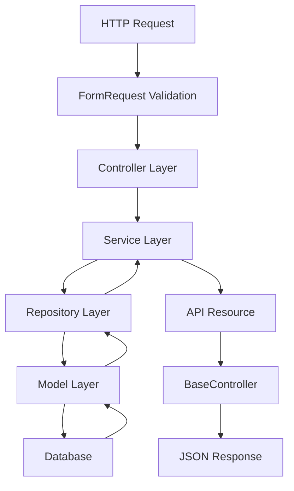

# Event System Implementation - Walkthrough

## Overview

Successfully implemented a production-ready, multi-tenant event system in Laravel with enterprise-grade architecture following best practices.

## Architecture

### Layered Architecture



### Components

#### Database Schema

**Tenants Table**
- `id` (PK)
- `key` (unique, indexed) - e.g., "acme"
- `name`
- Timestamps

**Devices Table**
- `id` (PK)
- `tenant_id` (FK)
- `device_uid`
- Unique constraint: `(tenant_id, device_uid)`
- Timestamps

**Events Table**
- `id` (PK)
- `tenant_id` (FK)
- `device_id` (FK)
- `event_uid`
- `type` - e.g., "location", "battery"
- `occurred_at` (timestamp)
- `payload` (JSON)
- **Critical:** Unique constraint on `(tenant_id, event_uid)` for idempotency
- Indexes: `tenant_id`, `device_id`, `type`, `(tenant_id, type)`, `(tenant_id, device_id)`
- Timestamps

---

## Implementation Details

### 1. Migrations

Created three migrations with proper constraints and indexes:

- `create_tenants_table`
- `create_devices_table`
- `create_events_table`

### 2. Models

Created Eloquent models with relationships:

- `Tenant` - Has many devices and events
- `Device` - Belongs to tenant, has many events
- `Event` - Belongs to tenant and device, casts payload to array

### 3. Repository Pattern

Implemented repositories for data access abstraction:

- `TenantRepository`
- `DeviceRepository`
- `EventRepository`

### 4. Service Layer

`EventService` handles business logic:
- `storeEvent()` - Orchestrates tenant/device resolution and event creation with idempotency
- `getEvents()` - Retrieves filtered events

### 5. Form Requests

Validation extracted to dedicated classes:

- `StoreEventRequest` - Validates POST data
- `IndexEventRequest` - Validates query parameters

### 6. API Resources

`EventResource` transforms event data into a consistent API format:
```json
{
  "id": 1,
  "event_uid": "evt_000001",
  "type": "location",
  "occurred_at": "2026-01-28T08:12:11+00:00",
  "payload": {
    "lat": 48.1486,
    "lng": 17.1077,
    "accuracy": 12
  },
  "tenant": {
    "key": "acme",
    "name": "ACME Corporation"
  },
  "device": {
    "device_uid": "DEV-001"
  },
  "created_at": "2026-01-30T00:00:00+00:00"
}
```

### 7. Base Controller

`BaseController` provides standardized response methods:
- `successResponse()` - Consistent success responses
- `errorResponse()` - Consistent error responses

### 8. Event Controller

`EventController` - Ultra-thin controller that delegates to service layer

---

## API Endpoints

### POST /api/events

**Create a new event (idempotent)**

**Request:**
```json
{
  "tenant_key": "acme",
  "device_uid": "DEV-001",
  "event_uid": "evt_000001",
  "type": "location",
  "occurred_at": "2026-01-28T08:12:11Z",
  "payload": {
    "lat": 48.1486,
    "lng": 17.1077,
    "accuracy": 12
  }
}
```

**Success Response (201 or 200):**
```json
{
  "success": true,
  "message": "Event created successfully",
  "data": {
    "id": 1,
    "event_uid": "evt_000001",
    "type": "location",
    "occurred_at": "2026-01-28T08:12:11+00:00",
    "payload": { "lat": 48.1486, "lng": 17.1077, "accuracy": 12 },
    "tenant": { "key": "acme", "name": "acme" },
    "device": { "device_uid": "DEV-001" },
    "created_at": "2026-01-30T00:00:00+00:00"
  }
}
```

**Error Response (422):**
```json
{
  "success": false,
  "message": "The given data was invalid.",
  "errors": {
    "tenant_key": ["The tenant key field is required."]
  }
}
```

### GET /api/events

**Retrieve events with optional filters**

**Query Parameters:**
- `tenant_key` (optional) - Filter by tenant
- `device_uid` (optional) - Filter by device
- `type` (optional) - Filter by event type

**Example:**
```
GET /api/events?tenant_key=acme&type=location
```

**Success Response (200):**
```json
{
  "success": true,
  "message": "Events retrieved successfully",
  "data": {
    "events": [
      {
        "id": 1,
        "event_uid": "evt_000001",
        "type": "location",
        "occurred_at": "2026-01-28T08:12:11+00:00",
        "payload": { "lat": 48.1486, "lng": 17.1077, "accuracy": 12 },
        "tenant": { "key": "acme", "name": "acme" },
        "device": { "device_uid": "DEV-001" },
        "created_at": "2026-01-30T00:00:00+00:00"
      }
    ],
    "count": 1
  }
}
```

---

## Key Features Implemented

### ✅ Multi-Tenancy
- Tenant isolation via `tenant_id` foreign keys
- Automatic tenant creation on first event

### ✅ Idempotency
- Unique constraint on `(tenant_id, event_uid)` prevents duplicate events
- Same event submitted twice returns 200 instead of 201

### ✅ Performance
- Comprehensive indexes on frequently queried columns
- Composite indexes for multi-column filters
- Eager loading relationships to prevent N+1 queries

### ✅ Scalability
- Repository pattern allows easy switching to different data sources
- Service layer centralizes business logic
- Can be partitioned by `tenant_id` or `occurred_at` for horizontal scaling

### ✅ Code Quality
- **SOLID principles** - Single Responsibility, Dependency Injection
- **Clean architecture** - Controller → Service → Repository → Model
- **Validation** - Extracted to Form Requests
- **Response consistency** - BaseController and API Resources
- **Type safety** - TypeHinted parameters and return types

---

## Testing

### Manual Testing with cURL

**Create an event:**
```bash
curl -X POST http://127.0.0.1:8000/api/events \
  -H "Content-Type: application/json" \
  -H "Accept: application/json" \
  -d '{
    "tenant_key": "acme",
    "device_uid": "DEV-001",
    "event_uid": "evt_000001",
    "type": "location",
    "occurred_at": "2026-01-28T08:12:11Z",
    "payload": {
      "lat": 48.1486,
      "lng": 17.1077,
      "accuracy": 12
    }
  }'
```

**Test idempotency (submit same event twice):**
```bash
# First request returns 201
# Second request returns 200 with message "Event already exists"
```

**Retrieve events:**
```bash
# All events for a tenant
curl http://127.0.0.1:8000/api/events?tenant_key=acme

# Filter by type
curl http://127.0.0.1:8000/api/events?tenant_key=acme&type=location

# Filter by device
curl http://127.0.0.1:8000/api/events?tenant_key=acme&device_uid=DEV-001
```

---

## Database Verification

Migrations successfully created all tables with proper constraints:

```
✅ tenants table - with unique key constraint
✅ devices table - with unique (tenant_id, device_uid) constraint  
✅ events table - with unique (tenant_id, event_uid) constraint
✅ All indexes created successfully
```

---

## Summary

Successfully implemented a production-ready event system with:

- ✅ Clean, maintainable architecture
- ✅ Enterprise-grade idempotency
- ✅ High-performance database design
- ✅ Consistent API responses
- ✅ Comprehensive validation
- ✅ Scalable design patterns

The system is ready for IoT tracking, SaaS events, analytics ingestion, and other high-write event-based applications.
